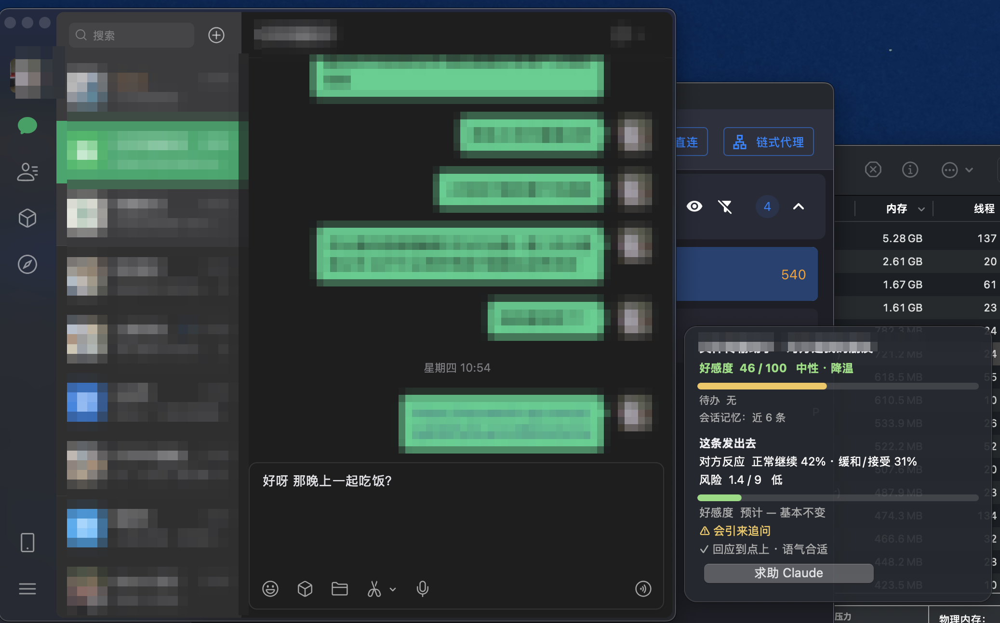
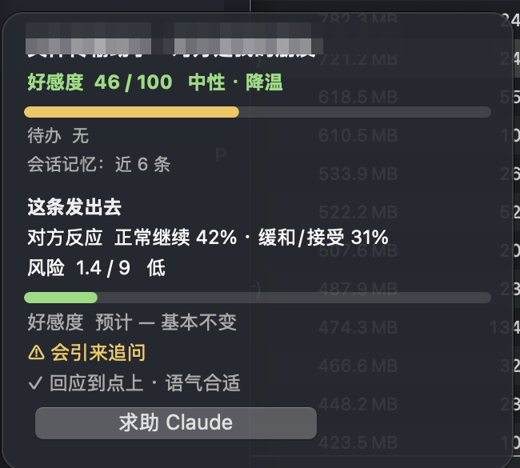

# Laya Chat

微信（macOS）旁边的一张小卡片：读屏幕上的聊天和你正在打的草稿，用本地跑的小模型 [Laya](https://github.com/NandhaKishorM/laya) 告诉你三件事。

- **好感度**：对方现在对你的态度（0 到 100）、走势、悬着没回的事。
- **这条发出去会怎样**：打完字停一秒，给出对方最可能的反应、风险、好感度预计怎么变、语气合不合适。对方回复之后，再用真实回复算出好感度实际变了多少。
- **求助**：拿不准时按一下，把对话和草稿交给本机的 Claude 或 Codex，给一句评价和三条改写，一键填入输入框。

全程本地、不联网、不发聊天内容（只有求助按钮例外）。**从不替你发送。**

<h2>先看这几句</h2>

<h3>1. 这个项目只是为了好玩。它替代不了真实的人际关系，也替代不了你自己的判断。</h3>

卡片上的分数和"对方会怎么反应"都是一个小模型的猜测，它见过的对话很有限，错起来会错得离谱。别把好感度当成对方真实的想法，别因为它的一句"风险高"就不敢说话，更别拿它做任何要紧的决定。好好聊天的办法从来只有一个：认真听，认真说。

<h3>2. 完全开源，欢迎二次开发。遵守 MIT 协议就行。</h3>

改成你自己的样子、接别的聊天软件、换别的模型、拿去商用，都可以，保留 LICENSE 里的版权声明即可。训练数据的流水线和微调笔记本也都在仓库里，想训一版更懂你的，照着跑。

<h3>3. 它只看你自己电脑上、你自己有权看的聊天，数据留在本机，发送永远由你按。</h3>

程序不联网、不上传、没有服务器；只有你主动点"求助"那一下，对话才会发给你本机的 Claude 或 Codex。它不改微信、不注入、不 hook，只读系统辅助功能树。使用时请遵守微信的用户协议，后果自负。本项目和腾讯、微信没有任何关系。

<p align="center">
  
</p>
<p align="center">
  
</p>

```
小王 · 对方是我的朋友
好感度  57 / 100   友好 · 降温
▇▇▇▇▇▇▇▇▇▇▇▁▁▁▁▁▁▁▁▁
待办
☐ 回复「你在干啥到底」
会话记忆：近 14 条

这条发出去
对方反应  继续追问 31% · 更不高兴 20%
风险  5.0 / 9   中
好感度  预计 ▼ 11   略降
⚠ 没回应到点上 · 语气太冷
✓ 能收住
[求助 Claude]
```

## 安装

需要：macOS（Apple 芯片），微信 mac 4.x，[uv](https://docs.astral.sh/uv/)。求助按钮需要本机装有 `claude` 或 `codex` 命令，没有也能用。

**方式一：让 AI 助手装（推荐）。** 打开 Claude Code 或 Codex，把下面这段整个粘贴进去：

```text
请帮我安装 Laya Chat（微信回复副驾，macOS）。
1. 把 https://github.com/TuYv/laya-chat 克隆到 ~/laya-chat。
2. 读 ~/laya-chat/SKILL.md，严格按它的步骤执行：建 Python 3.12 虚拟环境并装依赖、下载模型权重并自检、打包成 ~/Applications/Laya Chat.app 并加开机启动。
3. 需要我在系统设置里开"屏幕录制"和"辅助功能"权限时，告诉我具体点哪里，等我做完再继续。
4. 装完后教我怎么验收：打开微信一个会话、在输入框打一句话，看微信右侧的卡片有没有出现判断结果。
注意：不要替我发送任何消息，不要在验收时自己往微信输入框里填字，不要把我的聊天内容写进任何文件。
```

助手装完就可以关掉，程序独立运行，之后不再需要它。

**方式二：手动。**

```bash
git clone https://github.com/TuYv/laya-chat ~/laya-chat && cd ~/laya-chat
uv venv --python 3.12 .venv
uv pip install --python .venv/bin/python -r requirements.txt
installer/make_app.sh                 # 打包成 ~/Applications/Laya Chat.app，加开机启动
open "$HOME/Applications/Laya Chat.app"
```

第一次启动允许"屏幕录制"和"辅助功能"两项权限；第一次判断会下载约 850 MB 权重。怎么用、每一块什么意思、常见问题：[docs/USAGE.md](docs/USAGE.md)。

## 配置 `~/.laya-chat/config.json`

| 键 | 默认 | 说明 |
|---|---|---|
| `relationships` | `{}` | 会话名到一句话关系，如 `{"张经理": "对方是我的同事"}` |
| `relationship_default` | `对方是我的朋友` | 没单独设定时的关系 |
| `ai_tool` | `auto` | 求助按钮用哪个：`auto` 按本机装了哪个选，优先 claude；或 `claude`、`codex`、`none` |
| `keep_history` | `true` | 在本机记录看到过的消息和"预计 vs 实际"，`python -m laya_chat --clear` 清空 |
| `memory_messages` / `memory_chars` | `30` / `700` | 好感度判断用最近多少条、最多多少字（超出从最早的丢，最新的永远保留；模型一次读不了太多） |
| `context_messages` | `10` | 草稿判断带最近多少条 |
| `history_max` | `500` | 每个会话在本机最多记多少条 |
| `model` / `subfolder` | `ricky136/laya-chat` / 空 | 用哪份权重；本地目录路径也行 |
| `poll_interval` / `draft_debounce` | `1.0` / `1.2` | 读屏间隔、草稿停顿多久后判断（秒） |

## 模型质量

默认权重 [ricky136/laya-chat](https://huggingface.co/ricky136/laya-chat) 是从 Laya 多语言权重微调来的，第一次启动自动下载（约 650 MB）。和老师模型标签的一致率：

| | 微调前 | 微调后 dev | 微调后 test |
|---|---|---|---|
| overall | 0.32 | 0.585 | 0.615 |

分题看，语气、悬事、追问、回应到点上、走势都在 0.74 以上，对方反应 0.50，风险最弱 0.22。训练集只有 1638 条草稿、多为合成对话，判断当参考，别当结论。

仓库里 `data/` 是完整的训练数据流水线（公开对话 + 合成对话 + 老师模型打标），`notebooks/` 是 Kaggle 免费 GPU 上的微调笔记本，想用自己的数据再训一版照着跑就行。

## 它怎么读微信

微信 mac 4.x 把消息列表和输入框放在系统辅助功能树里：每条气泡的正文在 title 属性，输入框的内容在 AXValue。所以不需要文字识别，读一次约 150 毫秒。辅助功能树分不出左右，程序在可见消息变化时截一张窗口图，沿每条消息那一行采像素：绿色是你，其它是对方。

## 限制

- 只支持微信 mac 4.x 默认气泡配色；只在 4.1 上验证过。
- 群聊按一对一处理。
- 判断质量取决于权重，见上。

## 目录

```
laya_chat/      程序本体（ax_reader 读微信 · engine 调 Laya · overlay 卡片 · app 主循环 · ai_help 求助）
installer/      打包 .app 与开机启动
docs/           使用指引
data/           训练数据流水线（见 data/README.md）
notebooks/      Kaggle 微调笔记本
eval/           评测脚本与 30 条标注对话
scripts/        第一版（助手驱动）的脚本，保留作开发工具
SKILL.md        给 AI 助手看的安装步骤（方式一里的 prompt 会让它读这个文件）
```

## 致谢与许可

代码 MIT（见 LICENSE）。判断模型 Laya（Apache 2.0）；题目形式和 30 条标注对话来自 jev-chat-jarvis（MIT）；部分训练对话来自清华 LCCC。详见 NOTICE。
